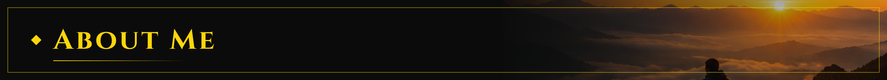

  

  

  

---

  

- 💼 I build software for **real business problems**: inventory, billing, product catalogs.
- ⚡ I ship fast using modern frameworks and AI-assisted development.
- 🌍 Open to **freelance work** with clients worldwide.
- 🎯 Currently building: a business website with an admin panel for a computer & robotics store.

---

  

<table>
<tr>
<td width="50%" valign="top">

### 🤖 Sky Computers & Robotics
Business website + product catalog with an admin panel to add and hide products.

</td>
<td width="50%" valign="top">

### 🩺 PulseWise
Medical calculator PWA with **19 clinical calculators**, installable on mobile.

📂 [Code](https://github.com/Hamza313-cyber/Calculator-)
</td>
</tr>
<tr>
<td width="50%" valign="top">

### 🧠 AEOS
AI operating-system dashboard.

📂 [Code](https://github.com/Hamza313-cyber/aeos)
</td>
<td width="50%" valign="top">

### 📈 CryptoTrack
Crypto price tracker with live market data.

</td>
</tr>
</table>

---

  

  

---

  

| 🛍️ Shop & business websites | 📦 Inventory / billing tools | 📱 Mobile-friendly PWAs |
|:---:|:---:|:---:|
| With an admin panel to add products | For shops & small businesses | Installable, works offline |

---

  

